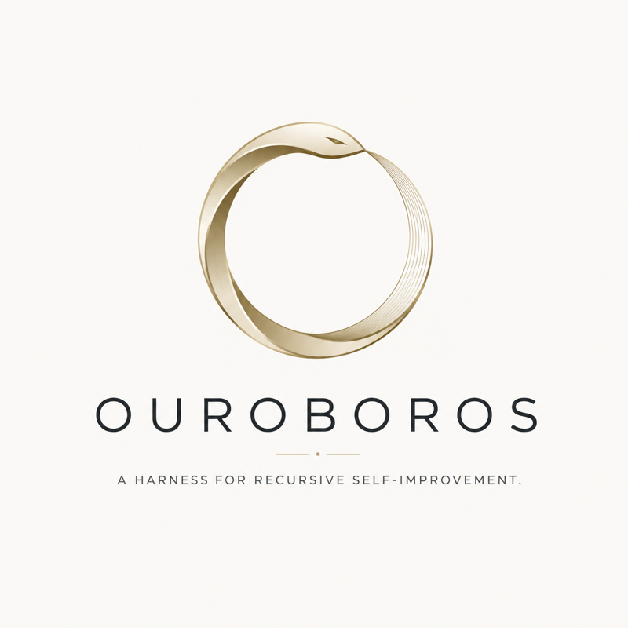

<p align="center">
  
</p>

<p align="center">
  <em>Agents that inspect, propose, test, and promote improvements to themselves — under explicit guardrails.</em>
</p>

<p align="center">
  <a href="https://github.com/QuXiangjie/Ouroboros/actions/workflows/ci.yml"></a>
  <a href="https://www.python.org/downloads/"></a>
  <a href="LICENSE"></a>
  <a href="https://github.com/astral-sh/ruff"></a>
  
</p>

<p align="center">
  <a href="#quick-start">Quick start</a> ·
  <a href="#how-it-works">How it works</a> ·
  <a href="#design-principles">Principles</a> ·
  <a href="#safety-model">Safety</a> ·
  <a href="#roadmap">Roadmap</a> ·
  <a href="#contributing">Contributing</a>
</p>

---

## What is Ouroboros?

**Ouroboros** is an evaluation-driven harness for **recursive self-improvement (RSI)**. It gives an agent a controlled loop in which it can run itself, observe the result, diagnose what went wrong, propose a modified version of itself, and — only if the evidence clears a gate — adopt that version as the new baseline.

The central idea is simple: *self-modification is an experiment, not a privilege.* Every proposed change is a **challenger** that must beat the current **baseline** on measurable evaluations before it is promoted. Anything that fails is rolled back, and everything that happened is traced.

```text
Execute → Observe → Evaluate → Reflect → Mutate → Validate → Gate
                                                              │
                                             Promote ◄────────┤
                                             Rollback ◄───────┘
```

Ouroboros is **model-agnostic** and **framework-agnostic**. It does not ship an agent; it ships the contracts and the loop that let *your* agent improve itself safely.

## Why?

Most "self-improving agent" demos are unconstrained: the model edits its own prompt or code, and whether that was a good idea is discovered later, if at all. Ouroboros takes the opposite stance:

| Unconstrained self-modification | Ouroboros |
| --- | --- |
| Change is applied, then judged | Change is judged, then applied |
| Regressions discovered in production | Regressions rejected at the gate |
| Improvement is a vibe | Improvement is a score delta |
| No lineage, no rollback | Every candidate has a parent, a generation, and a trace |
| Depth and cost are unbounded | Recursion is bounded by explicit budgets |

## Quick start

Requires Python 3.11+.

```bash
git clone https://github.com/QuXiangjie/Ouroboros.git
cd Ouroboros
python -m venv .venv && source .venv/bin/activate
pip install -e ".[dev]"
pytest -q
```

A complete improvement step in a few lines. Plug in your own runner, evaluator, reflector, and mutator; Ouroboros orchestrates the cycle and enforces the gate:

```python
from ouroboros import Candidate, Evaluation, ImprovementLoop, Trace
from ouroboros.gates import MinimumImprovementGate


class EchoRunner:
    """Runs a candidate against an input and records what happened."""
    def run(self, candidate: Candidate, input_data: object) -> Trace:
        prefix = candidate.payload.get("prefix", "")
        return Trace(candidate.id, input_data, f"{prefix}{input_data}")


class LengthEvaluator:
    """Scores a trace. Replace with your evals, benchmarks, or judges."""
    def evaluate(self, trace: Trace) -> Evaluation:
        return Evaluation(score=min(len(trace.output) / 20, 1.0))


class SimpleReflector:
    """Diagnoses why the candidate scored the way it did."""
    def reflect(self, candidate: Candidate, trace: Trace, evaluation: Evaluation) -> str:
        return "output too short; add context" if evaluation.score < 1.0 else "ok"


class PrefixMutator:
    """Proposes a challenger derived from the candidate plus the reflection."""
    def mutate(self, candidate: Candidate, reflection: str) -> Candidate:
        payload = {**candidate.payload, "prefix": candidate.payload.get("prefix", "") + "Answer: "}
        return Candidate(
            id=f"{candidate.id}.{candidate.generation + 1}",
            payload=payload,
            parent_id=candidate.id,
            generation=candidate.generation + 1,
        )


loop = ImprovementLoop(
    runner=EchoRunner(),
    evaluator=LengthEvaluator(),
    reflector=SimpleReflector(),
    mutator=PrefixMutator(),
    gate=MinimumImprovementGate(min_delta=0.05),
)

candidate = Candidate(id="v0", payload={})
for _ in range(3):
    candidate, decision = loop.step(candidate, "hello")
    print(f"{candidate.id:>10}  promote={decision.promote!s:<5}  {decision.reason}")
```

```text
      v0.1  promote=True   challenger improved score by 0.4000 (required 0.0500)
    v0.1.2  promote=True   challenger improved score by 0.3500 (required 0.0500)
    v0.1.2  promote=False  challenger delta 0.0000 is below required 0.0500
```

The third generation is rejected: the challenger no longer clears the minimum delta, so the loop keeps the previous candidate. No regression, no runaway drift.

## How it works

Ouroboros decomposes one improvement cycle into small, independently replaceable components. Each is a plain Python `Protocol` — no base classes to inherit, no framework lock-in.

```text
                 ┌──────────────────────────────────────────────┐
                 │               ImprovementLoop.step            │
                 └──────────────────────────────────────────────┘
   Candidate ──► Runner ──► Trace ──► Evaluator ──► Evaluation (baseline)
       │                                                   │
       │                                                   ▼
       │                                              Reflector ──► reflection
       │                                                   │
       ▼                                                   ▼
   Mutator ◄───────────────────────────────────────────────┘
       │
       ▼
   Challenger ──► Runner ──► Trace ──► Evaluator ──► Evaluation (challenger)
                                                           │
                                                           ▼
                                             Gate.decide(baseline, challenger)
                                                    │              │
                                                 promote        rollback
                                                    ▼              ▼
                                               challenger      candidate
```

| Component | Responsibility | Contract |
| --- | --- | --- |
| **Candidate** | A versioned agent configuration: prompts, policies, tools, model settings, code refs. Carries `parent_id` and `generation` for lineage. | `ouroboros.core.Candidate` |
| **Runner** | Executes a candidate against a task and emits a structured `Trace`. | `run(candidate, input) -> Trace` |
| **Evaluator** | Turns execution evidence into a normalized `score` plus supporting `metrics`. | `evaluate(trace) -> Evaluation` |
| **Reflector** | Diagnoses *why* the candidate succeeded or failed. | `reflect(candidate, trace, evaluation) -> str` |
| **Mutator** | Proposes a challenger from the candidate and the reflection. | `mutate(candidate, reflection) -> Candidate` |
| **Gate** | Makes the promotion decision. Deterministic wherever possible. | `decide(baseline, challenger) -> GateDecision` |

Ships today with `MinimumImprovementGate`, which promotes only when the challenger beats the baseline by a configurable minimum delta. Regression-aware, cost-aware, and confidence-aware gates are on the roadmap.

See [`docs/architecture.md`](docs/architecture.md) for the full component and invariant reference.

## Design principles

- **Evaluation before promotion.** No change is accepted without measurable evidence.
- **Rollback by default.** Regressions must be cheap to reverse; the loop never silently keeps a losing challenger.
- **Trace everything.** Every proposal, evaluation, reflection, and decision is inspectable and auditable.
- **Model-agnostic.** Adapters should work across model providers and agent frameworks.
- **Composable.** Runners, evaluators, mutators, gates, and memory are independently replaceable.
- **Safe recursion.** Depth, budgets, capabilities, and promotion criteria are always bounded.

## Safety model

Recursive self-improvement is only useful if it is controllable. Ouroboros treats the following as invariants, not options:

1. **Every recursion is bounded** by depth, time, token, and/or cost budgets.
2. **A candidate cannot promote itself.** Promotion requires an externalized gate decision.
3. **Baseline and challenger evaluations must be comparable** — same tasks, same evaluator.
4. **Promotion decisions retain enough evidence** for audit and rollback.
5. **Capability expansion requires stricter gates** than prompt or parameter changes.

The first implementation targets prompt- and configuration-level improvement. Tool creation, code mutation, memory optimization, and architecture search are layered on later, behind progressively stronger validation gates.

## Roadmap

- [x] Core loop contracts and typed traces
- [x] Minimum-improvement promotion gate
- [ ] Pluggable evaluator interface with deterministic eval suites
- [ ] Reflection and mutation strategies
- [ ] Regression-aware, cost-aware promotion gates
- [ ] Explicit `Validator` abstraction (currently the evaluator is re-run)
- [ ] Persistent experiment memory and candidate lineage store
- [ ] Recursion, token, and cost budgets enforced by the loop
- [ ] Provider and agent-framework adapters
- [ ] Benchmark harness and experiment dashboard

Ouroboros is in **early development**. The API will change. If you are building on it, pin a commit.

## Contributing

Contributions are welcome — especially evaluators, gates, and adapters for real agent frameworks.

```bash
pip install -e ".[dev]"
ruff check .
pytest -q
```

Please read [`CONTRIBUTING.md`](CONTRIBUTING.md) first. Changes to the improvement loop must preserve **observability**, **comparability**, and **reversibility**; changes that expand agent capabilities need stronger validation and explicit guardrails.

## The name

The [ouroboros](https://en.wikipedia.org/wiki/Ouroboros) — a serpent consuming its own tail — is the oldest symbol of recursion and self-renewal. It is also a loop that closes on itself: the system's output becomes its input. That is exactly the shape of this project, and exactly the reason it needs a gate.

## License

[MIT](LICENSE) © Jack Qu
